# Titanic 生存数据分析报告

> **数据来源**：`titanic_featured.csv`  
> **样本规模**：784 名乘客，14 个字段  
> **分析目标**：识别与乘客生存状态相关的关键因素，总结分组差异并解释可视化图表  
> **生成日期**：2026-09-19  
> **相关文件**：[分组统计结果](statistics.md) · [图表目录](figures)

---

## 一、执行摘要

Titanic 数据集的总体生存率为 **41.20%**，共 784 名乘客中约有 323 人生还、461 人遇难。数据分析显示，生存率并不是随机分布，而是呈现出明显的群体差异：

1. **性别是最强的单一预测因素**：女性生存率为 **74.06%**，男性仅为 **21.59%**，相差约 **52.5 个百分点**。
2. **舱位代表的社会阶层是第二强因素**：1 等舱生存率 **63.08%**，2 等舱 **50.91%**，3 等舱降至 **25.68%**。
3. **性别与舱位存在强烈交互**：1/2 等舱女性生存率达到 **94.58%**，而 3 等舱女性为 **47.24%**；男性则分别为 **29.11%** 和 **15.83%**。
4. **家庭规模与生存率呈倒 U 型关系**：独行者生存率为 **33.63%**，2～4 人家庭为 **57.60%**，5 人及以上家庭降至 **18.18%**。
5. **年龄的单独作用较弱，但儿童在高舱位具有明显优势**：1/2 等舱儿童生存率为 **95.24%**，3 等舱儿童为 **40.43%**。
6. **票价、是否有甲板信息和登船港主要是舱位的代理变量**：它们与生存率有一定相关性，但在控制舱位后，独立解释力有限。

综合来看，最有效的解释框架是：

```text
性别 + 舱位 + 家庭规模 + 年龄
```

其中性别和舱位决定主要差异，家庭结构提供额外信息，年龄需要结合舱位和性别理解。

---

## 二、数据与分析方法

### 2.1 数据概况

分析使用 `titanic_featured.csv`，包含 784 行、14 个字段。主要变量包括：

| 类型 | 字段 | 说明 |
|---|---|---|
| 目标变量 | `survived` | 是否生还，1 为生还，0 为遇难 |
| 个人信息 | `sex`、`age` | 性别与年龄 |
| 舱位信息 | `pclass`、`fare`、`has_deck` | 舱位等级、票价和甲板信息 |
| 家庭信息 | `sibsp`、`parch`、`FamilySize`、`IsAlone` | 兄弟姐妹/配偶、父母/子女、家庭规模和是否独行 |
| 登船信息 | `embarked` | 登船港口 |
| 衍生变量 | `AgeGroup`、`FareGroup`、`age_missing` | 年龄组、票价组和年龄缺失标记 |

### 2.2 分析方法

- 使用分组人数和生存率比较不同乘客群体的差异。
- 使用点二列相关系数衡量数值或二值变量与 `survived` 的线性关联。
- 使用 Cramér's V 和卡方检验衡量分类变量与生存状态的关联。
- 结合直方图、箱线图、条形图、散点图、热力图、核密度图和小提琴图解释变量分布。
- `age` 的缺失值按 `pclass + sex` 分组中位数填充；`fare` 在清洗阶段进行了 IQR 截断，因此最高票价集中在 73.20 附近。

---

## 三、分组统计结果

### 3.1 总体生存情况

| 指标 | 数值 |
|---|---:|
| 样本人数 | 784 |
| 生还人数 | 323 |
| 遇难人数 | 461 |
| 总体生存率 | 41.20% |

### 3.2 按性别统计

| 性别 | 人数 | 生还人数 | 生存率 |
|---|---:|---:|---:|
| 女性 | 293 | 217 | **74.06%** |
| 男性 | 491 | 106 | **21.59%** |

女性生存率约为男性的 3.4 倍，是全部单变量中最显著的差异。

### 3.3 按舱位统计

| 舱位 | 人数 | 生还人数 | 生存率 |
|---|---:|---:|---:|
| 1 等舱 | 214 | 135 | **63.08%** |
| 2 等舱 | 165 | 84 | **50.91%** |
| 3 等舱 | 405 | 104 | **25.68%** |

1 等舱生存率约为 3 等舱的 2.46 倍。舱位不仅反映票价，也可能反映登船位置、救援资源和逃生便利程度。

### 3.4 性别 × 舱位交叉统计

| 性别 | 1 等舱 | 2 等舱 | 3 等舱 |
|---|---:|---:|---:|
| 女性 | **96.77%** | **91.78%** | **47.24%** |
| 男性 | **37.19%** | **18.48%** | **15.83%** |

最关键的组合差异表现为：

| 分组 | 人数 | 生存率 |
|---|---:|---:|
| 女性 · 1/2 等舱 | 166 | **94.58%** |
| 女性 · 3 等舱 | 127 | **47.24%** |
| 男性 · 1/2 等舱 | 213 | **29.11%** |
| 男性 · 3 等舱 | 278 | **15.83%** |

因此，“女性优先”在数据中非常明显，但女性在 3 等舱的生存优势也大幅缩小。性别与舱位的交互作用不能忽略。

### 3.5 按年龄组统计

| 年龄组 | 人数 | 生存率 |
|---|---:|---:|
| Child | 68 | **57.35%** |
| Teen | 67 | 44.78% |
| YoungAdult | 415 | 40.24% |
| Adult | 212 | 38.68% |
| Senior | 22 | 22.73% |

年龄与生存率的线性相关仅为 **-0.075**，说明年龄关系并非简单线性。儿童整体生存率较高，但进一步分组后发现儿童优势高度依赖舱位：

| 儿童分组 | 人数 | 生存率 |
|---|---:|---:|
| 1/2 等舱儿童 | 21 | **95.24%** |
| 3 等舱儿童 | 47 | **40.43%** |

### 3.6 按家庭规模统计

| 家庭规模 | 人数 | 生存率 |
|---:|---:|---:|
| 1 人，独行 | 446 | 33.63% |
| 2 人 | 154 | 55.19% |
| 3 人 | 101 | 57.43% |
| 4 人 | 28 | **71.43%** |
| 5 人 | 13 | 23.08% |
| 6 人 | 22 | 13.64% |
| 7 人 | 12 | 33.33% |
| 8 人 | 6 | 0.00% |
| 11 人 | 2 | 0.00% |

合并后呈现清晰的倒 U 型：

| 家庭规模分组 | 人数 | 生存率 |
|---|---:|---:|
| 独行 | 446 | 33.63% |
| 2～4 人 | 283 | **57.60%** |
| 5 人及以上 | 55 | **18.18%** |

`FamilySize` 与生存率的线性相关只有 **0.015**，但 Cramér's V 为 **0.275**。这说明必须按规模分组观察，不能只依赖线性相关系数。

### 3.7 按票价组统计

| 票价组 | 人数 | 生存率 |
|---|---:|---:|
| VeryHigh | 196 | **61.22%** |
| High | 195 | 45.64% |
| Medium | 179 | 35.75% |
| Low | 214 | 23.36% |

票价与生存率呈正相关，但票价和舱位高度共线：

- `corr(pclass, fare) = -0.73`
- `corr(pclass, has_deck) = -0.72`

因此票价并不是独立于舱位的新解释因素，而是舱位和社会经济地位的代理变量。

### 3.8 按登船港统计

| 登船港 | 人数 | 生存率 |
|---|---:|---:|
| C | 155 | **58.06%** |
| S | 570 | 37.37% |
| Q | 59 | 33.90% |

C 港生存率较高，但 C 港旅客中约 **64.5%** 属于 1/2 等舱，远高于 S 港的 48.1% 和 Q 港的 8.5%。因此登船港的表面差异主要来自舱位结构。

---

## 四、图表清单与解读

### 4.1 数据质量与初步探索

#### 缺失值矩阵

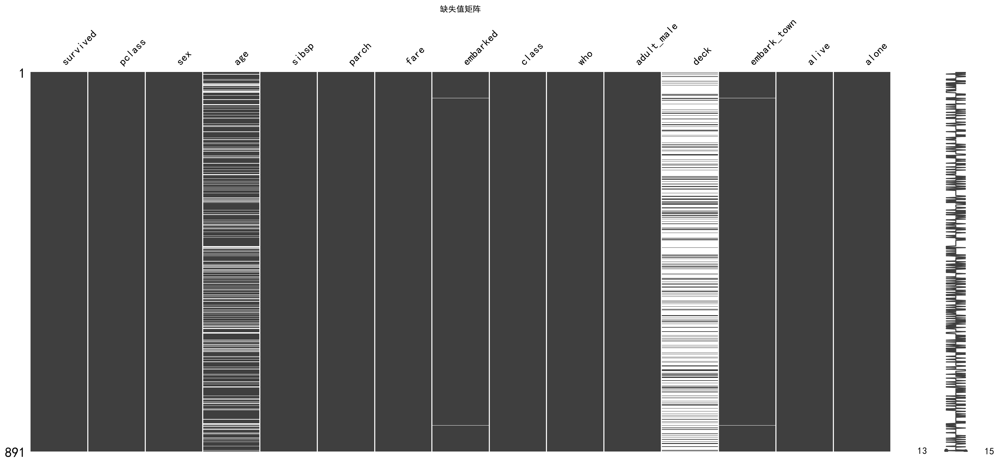

该图展示原始 Titanic 数据中各字段的缺失分布，可直观看出 `age`、`deck` 等字段存在较多缺失，为后续填充、二值化或删除提供依据。

#### 缺失值条形图

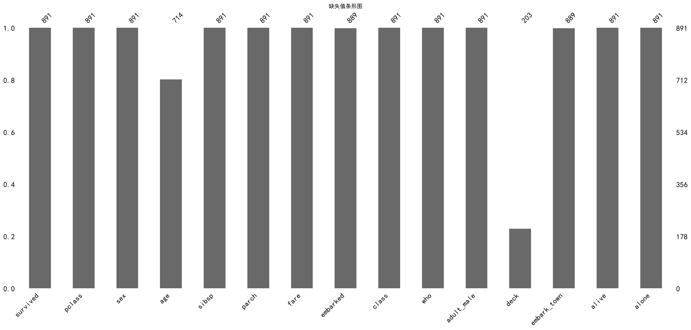

该图按字段比较缺失比例。`deck` 缺失比例超过 70%，不适合直接插补，因此后续转换为 `has_deck`；`age` 缺失约 20%，采用 `pclass + sex` 分组中位数填充。

#### 年龄与票价箱线图

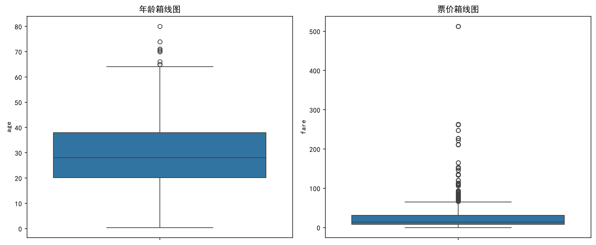

该图用于检查原始数据的离散程度和异常值。年龄整体处于合理范围；票价明显右偏且存在高值，后续在清洗阶段进行了 IQR 截断。

### 4.2 基础分布与分组图表

#### 年龄分布直方图

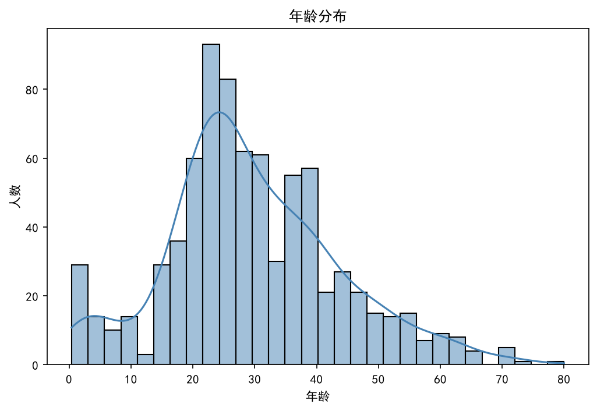

年龄主要集中于 22～38 岁，中位数约为 28 岁。分布存在少量婴幼儿和老年乘客，因此线性年龄效应较弱，使用年龄组或非线性变换更合适。

#### 票价分布直方图

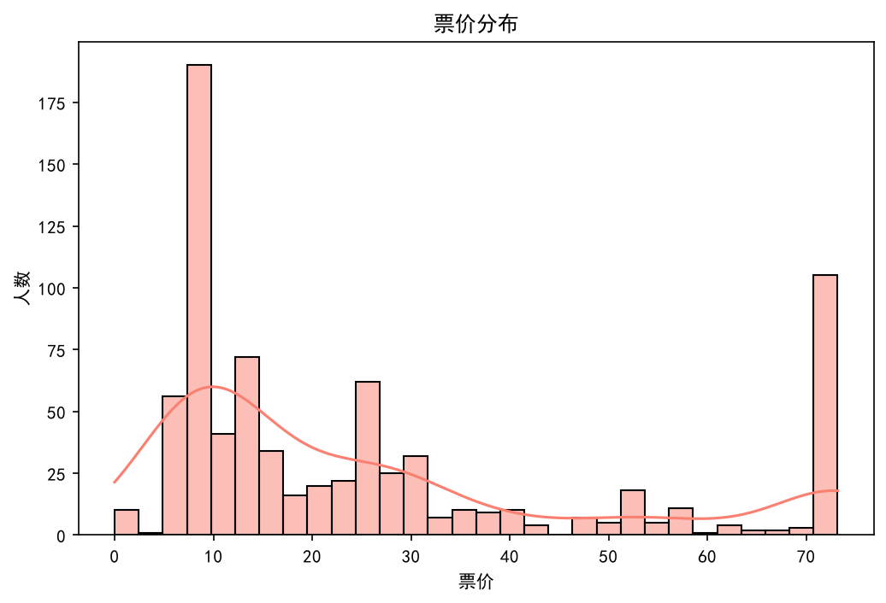

票价呈明显右偏分布，大多数乘客票价较低，少量高票价乘客拉高均值。如图所示，高票价端受到清洗阶段 IQR 截断影响，最高值约为 73.20。

#### 不同舱位的票价箱线图

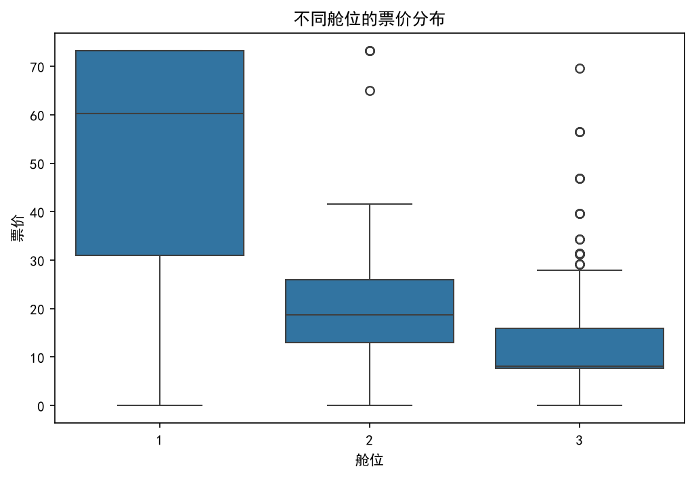

不同舱位的票价分离明显：1 等舱票价中位数约 **60.29**，2 等舱约 **18.75**，3 等舱约 **8.05**。该图解释了为什么 `pclass` 和 `fare` 高度相关。

#### 不同性别的生存人数条形图

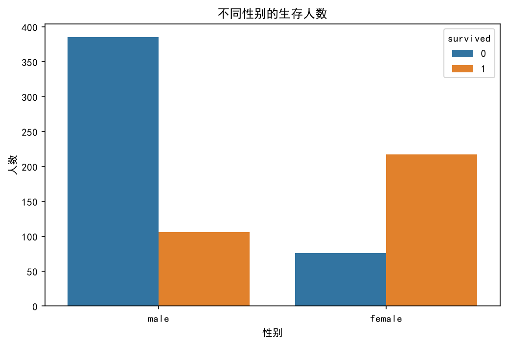

图中女性生还人数和男性遇难人数均明显集中。女性生存率为 74.06%，男性为 21.59%，表明性别是区分生存状态的首要变量。

#### 年龄与票价散点图

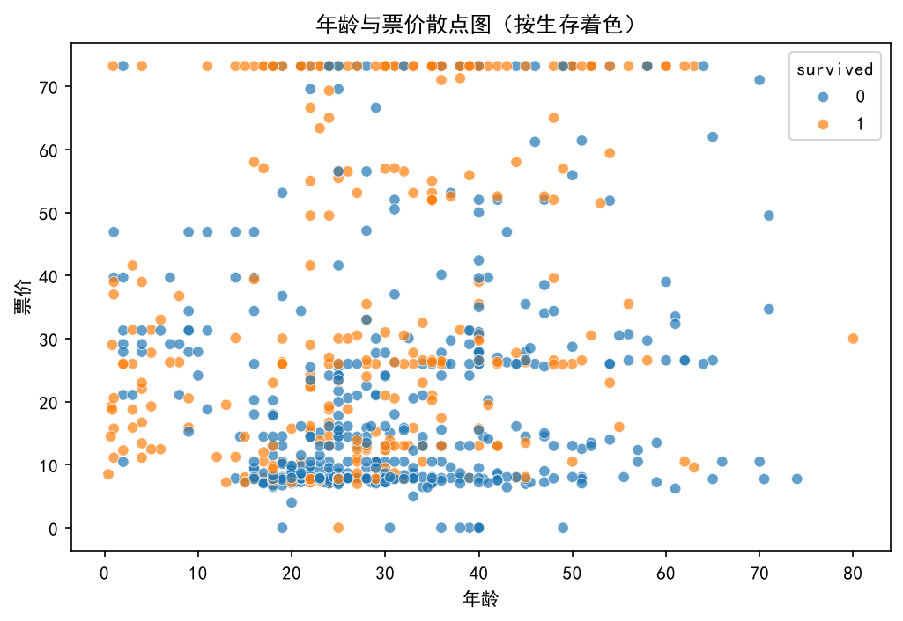

图中分别以颜色区分生还和遇难乘客。仅靠年龄和票价无法形成清晰边界，但高票价区域的生还比例整体更高，进一步说明票价信息与舱位、社会阶层相关，而不是年龄本身主导生存。

### 4.3 高级关联与分组图表

#### 数值特征相关性热力图

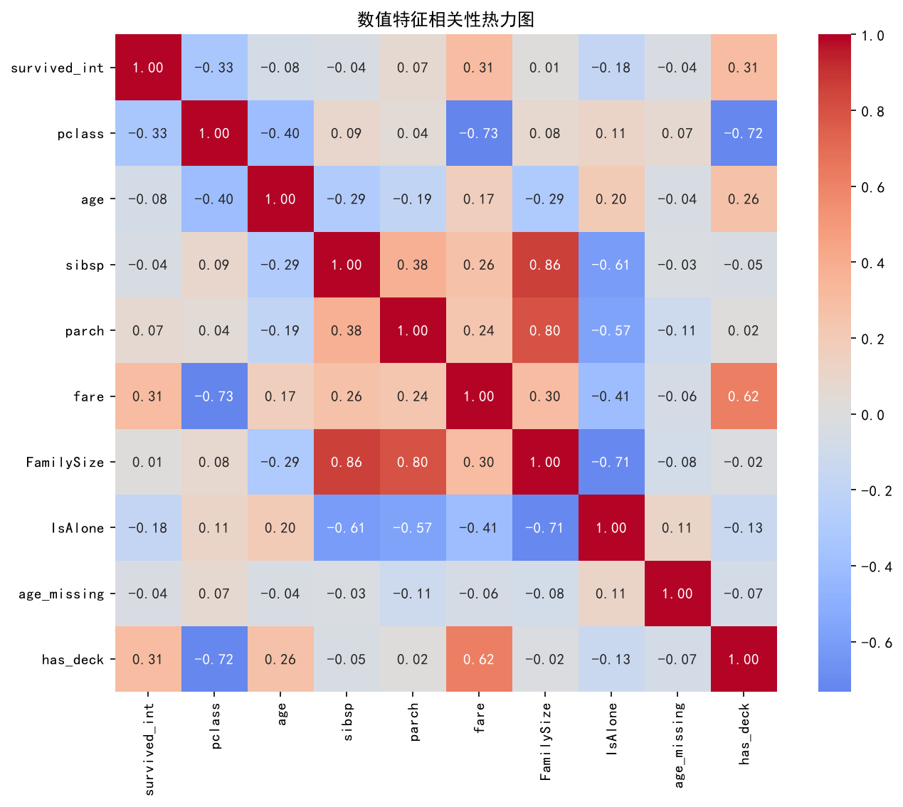

热力图展示了各数值变量与 `survived` 之间的相关方向。性别编码后的相关系数绝对值最大；`pclass` 与 `fare`、`has_deck` 之间存在强共线性，不建议在模型中同时重复使用。

#### 成对变量图

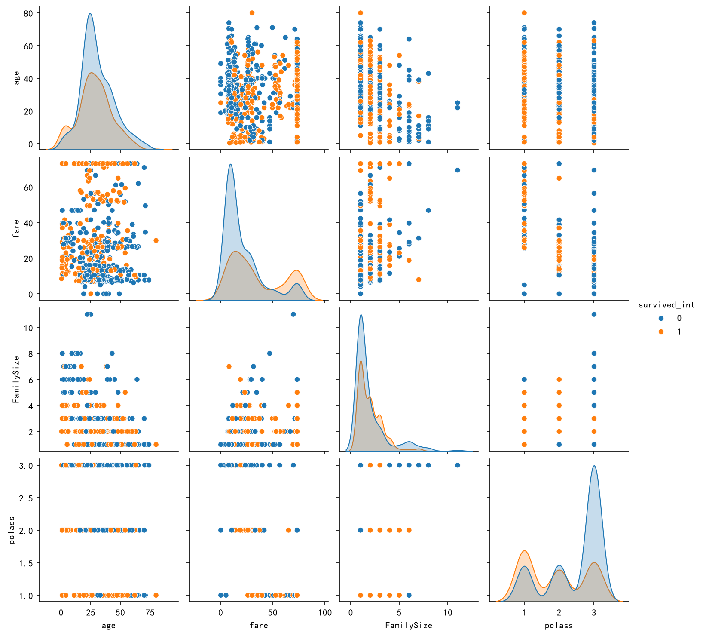

成对图展示年龄、票价、家庭规模和舱位之间的联合分布。不同生存状态之间存在重叠，说明不存在单一数值变量可以简单划分结果；舱位和票价的分层趋势比年龄和家庭规模更直观。

#### 性别 × 舱位生存率柱状图

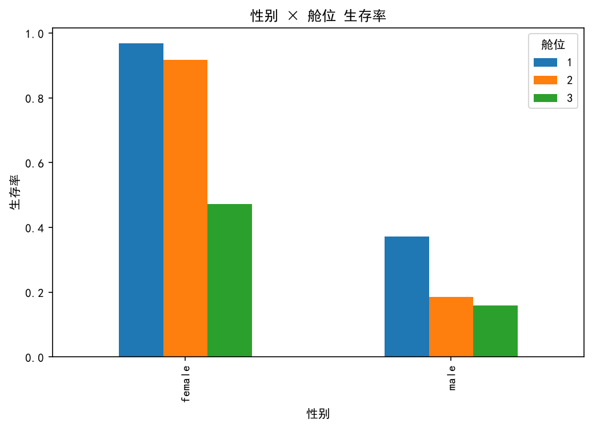

该图是最有解释力的分组图之一。女性在 1、2 等舱的生存率超过 90%，男性在 2、3 等舱均低于 20%。这说明性别和舱位不能分开解释，应关注二者交互。

#### 按生存状态划分的年龄核密度图

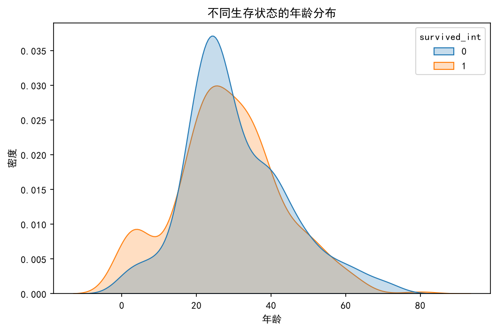

两条密度曲线大部分重叠，说明年龄单独区分生存状态的能力有限。生还者在较低年龄区间略有集中，但该优势仍需结合性别和舱位解释。

#### 按舱位与生存状态划分的年龄小提琴图

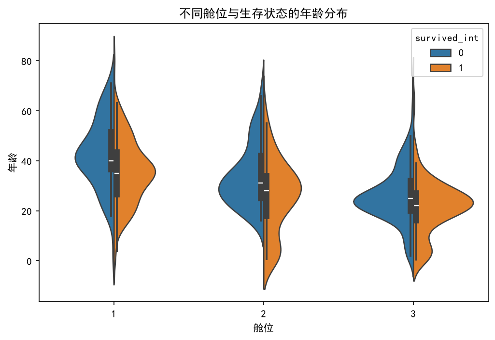

该图展示不同舱位、不同生存状态下年龄分布的差异。整体趋势再次说明年龄效应弱于舱位和性别效应；部分子组样本较少，不宜仅凭形状下强结论。

---

## 五、关键发现

### 发现 1：性别是最强的单一因素

- 女性生存率 **74.06%**，男性 **21.59%**。
- 男性标识与生存率的点二列相关系数为 **-0.516**。
- 性别分类变量的 Cramér's V 为 **0.513**。
- 几乎所有性别与舱位组合中，女性生存率都高于男性。

### 发现 2：舱位及其代理变量构成第二层差异

- 生存率随舱位下降而降低：1 等 **63.08%** > 2 等 **50.91%** > 3 等 **25.68%**。
- `fare` 和 `has_deck` 与 `pclass` 高度相关，属于舱位的代理变量。
- 建模时优先保留 `pclass`，避免 `pclass + fare + has_deck` 造成重复信息和共线性。

### 发现 3：性别与舱位的交互作用非常显著

- 1/2 等舱女性生存率 **94.58%**，3 等舱女性仅 **47.24%**。
- 3 等舱女性的生存率仍高于男性，但优势明显缩小。
- 男性即使位于 1 等舱，生存率也只有 **37.19%**。

### 发现 4：家庭规模呈倒 U 型

- 独行生存率 **33.63%**。
- 2～4 人家庭生存率 **57.60%**。
- 5 人及以上家庭生存率 **18.18%**。
- 家庭结构的保护作用并非线性，2～4 人可能是交流、协助和救援效率较平衡的规模。

### 发现 5：儿童优势只在较高舱位明显

- 1/2 等舱儿童生存率 **95.24%**。
- 3 等舱儿童生存率 **40.43%**。
- 年龄的总体线性相关很弱，单独使用年龄解释生存率容易得到误导性结论。

### 发现 6：登船港、sibsp、parch 和缺失标记不是核心独立因素

- 登船港差异主要由舱位结构造成。
- `sibsp` 与生存率的关系不显著，`parch` 仅处于边缘显著水平。
- `age_missing` 与生存率无显著关系，说明缺失标记本身没有提供稳定的额外信息。

---

## 六、结论

1. **Titanic 生存率主要由社会角色和资源条件共同决定。** 性别是第一解释变量，舱位及其代表的社会阶层是第二解释变量。
2. **“女性与儿童优先”在数据中成立，但并非对所有人都同等有效。** 女性和高舱位儿童得到明显保护，3 等舱乘客仍面临较高风险。
3. **家庭规模提供非线性信息。** 独行和大型家庭风险较高，2～4 人家庭的生存率最高。
4. **票价、甲板信息和登船港更适合作为辅助变量，而不是独立核心因素。** 它们与舱位高度相关，重复使用会降低模型的可解释性。
5. **适合优先构建的基础模型是：** `sex + pclass + age + FamilySize`，并根据分析结果考虑：
   - `sex × pclass` 交互项；
   - `age` 分箱或非线性变换；
   - `FamilySize` 分组为“独行 / 2～4 人 / 5 人及以上”；
   - 使用 `pclass` 代表票价和甲板信息，避免共线性。

已有描述性建模结果显示，使用 `sex + pclass + age + FamilySize` 的 Logistic 回归训练集准确率约为 **78.9%**，明显高于 41.2% 的基准生存率。但该数值属于训练集表现，不能直接视为模型的泛化能力，最终仍应通过独立验证集或交叉验证评估。

---

## 七、分析局限

1. 本报告发现的是观测数据中的相关关系，不能直接证明因果关系。
2. `age` 约 20% 缺失，虽然采用分组中位数填充，但仍可能削弱年龄效应。
3. `fare` 经过 IQR 截断，极端票价信息被压缩，可能低估高票价群体的差异。
4. 家庭规模为 5 人以上、老年女性、Q 港等子组样本量较小，生存率波动大，结论需谨慎。
5. 当前图表主要为探索性可视化，若用于预测建模，应进一步进行特征选择、交叉验证和误差分析。

---

## 八、报告输出文件

| 文件 | 内容 |
|---|---|
| `analysis_report.md` | 本数据分析报告 |
| `statistics.md` | 分组统计、相关系数和 Cramér's V 等详细结果 |
| `figures/` | 数据质量、分布、分组比较和高级关联图表 |
| `titanic_featured.csv` | 报告使用的特征工程后数据 |